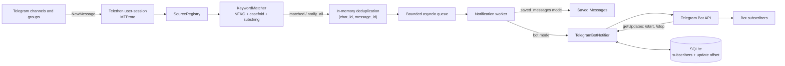

# Архітектура Telegram Keyword Monitor

## Призначення

Telegram Keyword Monitor — це окремий event-driven Python-сервіс, а не MCP-сервер. Він:

1. входить у Telegram як звичайний користувач;
2. слухає нові повідомлення тільки в налаштованих каналах і чатах;
3. застосовує keyword-фільтри або правило `notify_all=True`;
4. формує короткий alert із посиланням на оригінальне повідомлення;
5. надсилає alert у Saved Messages або всім користувачам, які підписалися на окремого бота.

Права адміністратора в monitored-чатах не потрібні. User-session бачить ті самі діалоги, що
й відповідний Telegram-акаунт.

## Технології

| Компонент | Технологія | Навіщо використовується |
|---|---|---|
| Runtime | Python 3.11+ та `asyncio` | Асинхронний listener, черги, polling і graceful shutdown |
| Telegram user client | Telethon 1.44+ | MTProto-підключення від імені звичайного акаунта та `NewMessage` events |
| Telegram bot client | Telegram Bot API через HTTPX | `/start`, `/stop` та push-розсилка підписникам |
| Конфігурація секретів | `python-dotenv` | Завантаження `.env` |
| Business-конфіг | TOML через стандартний `tomllib` | Локальні джерела, фільтри та runtime-параметри |
| AI observation contract | UTF-8 text + strict JSON Schema | Поточні system prompt і response schema, приватна policy, typed result і reproducible hash |
| AI API client | OpenAI Python SDK 2.x + `AsyncOpenAI` Responses API | Ізольований request, bounded retries, timeout і failure normalization |
| Фільтрація | Власний Unicode substring matcher | Позитивні `keywords`, негативні `keywords_to_skip`, NFKC та `casefold()` |
| Персистентний стан | SQLite | Підписники бота та Bot API update offset |
| Тести | pytest, pytest-asyncio, pytest-cov | Офлайн unit та integration-style перевірки |
| Статичний аналіз | Ruff | Lint і форматування Python-коду |
| Деплой | Docker і Docker Compose | Довгоживучий процес та persistent volume для SQLite |

## Дві Telegram-ідентичності

Застосунок використовує два незалежні способи доступу до Telegram:

- **User-session / MTProto** читає канали й групи. Для нього потрібні
  `TELEGRAM_API_ID`, `TELEGRAM_API_HASH` і `TELEGRAM_SESSION_STRING`.
- **Bot API** приймає команди підписки й доставляє alerts. Для нього потрібен
  `TELEGRAM_BOT_TOKEN`.

Бота не потрібно додавати в monitored-канали. Він не читає джерела; це робить user-session.

## Загальна схема



## Основні модулі

| Файл | Відповідальність |
|---|---|
| [`config.py`](src/telegram_monitor/config.py) | Завантаження й валідація локального `config.toml` |
| [`models.py`](src/telegram_monitor/models.py) | Dataclass-моделі та валідація конфігурації |
| [`credentials.py`](src/telegram_monitor/credentials.py) | Безпечне читання Telegram credentials і перевірка наявності OpenAI key |
| [`prompt_bundle.py`](src/telegram_monitor/prompt_bundle.py) | Валідація поточного prompt bundle та обчислення `prompt_hash` |
| [`ai_models.py`](src/telegram_monitor/ai_models.py) | Typed semantic result, technical-status enum і строгий parser AI-відповіді |
| [`openai_client.py`](src/telegram_monitor/openai_client.py) | Ізольований AsyncOpenAI Responses client, timeout/retry policy і normalized outcome |
| [`ai_observer.py`](src/telegram_monitor/ai_observer.py) | Reply context, спільний end-to-end deadline та fail-open observation report |
| [`client.py`](src/telegram_monitor/client.py) | Створення Telethon client із `StringSession`, reconnect і catch-up |
| [`registry.py`](src/telegram_monitor/registry.py) | Резолв username/ID у стабільні Telegram dialog IDs |
| [`matcher.py`](src/telegram_monitor/matcher.py) | Unicode-нормалізація та пошук keyword fragments |
| [`service.py`](src/telegram_monitor/service.py) | Event handler, startup buffer, deduplication, queue і notification worker |
| [`formatting.py`](src/telegram_monitor/formatting.py) | Формування plain-text alert і Telegram deep link |
| [`notifier.py`](src/telegram_monitor/notifier.py) | Saved Messages notifier, Bot API client, polling команд і broadcast |
| [`subscriber_store.py`](src/telegram_monitor/subscriber_store.py) | SQLite-сховище підписників і Bot API offset |
| [`app.py`](src/telegram_monitor/app.py) | Побудова компонентів та lifecycle застосунку |
| [`cli.py`](src/telegram_monitor/cli.py) | Команди `run`, `list-chats`, `generate-session`, `check`, `ai-check` |

## Послідовність запуску

1. CLI налаштовує стандартний Python logging.
2. `config.toml` перетворюється на `MonitorConfig` і перевіряється: sources, timezone,
   queue/retry limits, bot limit та вкладена `[ai_observation]`.
3. Credentials завантажуються з `.env`.
4. Створюється Telethon client із `StringSession`.
5. Якщо observation увімкнений, один optional observer будується без live OpenAI probe;
   setup failure перетворюється на reusable fail-open `api_error` observer.
6. До підключення реєструється catch-all `NewMessage` handler, щоб не втратити events під час
   завантаження діалогів.
7. Telethon перевіряє авторизацію user-session.
8. `SourceRegistry` зіставляє налаштований username або `-100…` ID з доступними dialogs.
9. Запускається notifier:
   - Saved Messages mode не потребує окремого background task;
   - bot mode викликає `getMe`, перевіряє відсутність webhook і запускає `getUpdates` polling.
10. Запускається notification worker і обробляється bounded startup buffer.
11. Worker для кожного accepted job виконує optional reply lookup та один logical AI
    observation, формує один alert і передає незмінний рядок у Telegram delivery retries.
12. Основна coroutine чекає відключення Telethon до сигналу або фатальної помилки bot polling.

## Контракт AI-відповіді

`prompts/response-format.json` містить поточний об'єкт `text.format` для
Responses API з `type = "json_schema"`, `name = "telegram_mobility_observation"`,
`strict = true` і root schema з
`additionalProperties = false`. Усі поля є required; nullable `location` та `event`
передаються як `null`, а не пропускаються. Цей JSON-файл є source of truth для wire format,
а відповідність Python enums і моделі йому перевіряють loader та контрактні тести. Додатковий
локальний parser окремо обмежує `reason` до 240 символів, оскільки `maxLength` не входить до
використаного Structured Outputs subset.

Семантична відповідь моделюється frozen dataclass `AIObservationResult` із полями:

- `decision`: `accept`, `reject` або `review`;
- `confidence`: число від 0 до 1;
- `location` і `event`: нормалізовані фрагменти або `null`;
- `temporal_relevance`: `current`, `historical` або `unclear`;
- `reason_code` та короткий `reason`.

Важливі semantic mappings:

- `unrelated_content` є лише reject-причиною і поєднується з `decision = "reject"`;
- `no_location` і `no_event` можуть супроводжувати `review`, якщо повідомлення
  потенційно корисне, але йому бракує цього контексту; коли відсутній компонент
  однозначно робить текст некорисним, вони поєднуються з `reject`;
- `historical_context` завжди означає `decision = "review"` разом із
  `temporal_relevance = "historical"`.

`parse_ai_observation_response()` виконує локальну перевірку навіть після strict Structured
Output: JSON decode, точний набір і типи полів, enum/range/length обмеження та semantic
consistency між рішенням, `reason_code`, локацією, подією і часовою релевантністю.
Некоректний payload завершується `AIResponseValidationError` і не перетворюється на `review`.

Технічний результат представлений окремим enum `AIObservationTechnicalStatus`: `timeout`,
`rate_limited`, `refusal`, `api_error`, `invalid_response` або `reply_context_error`. Тому
transport/API failure неможливо переплутати із семантичним `review`.

## Ізольований OpenAI client

Client використовує асинхронний OpenAI SDK і Responses API. Він не залежить від Telethon,
notification queue чи Telegram notifier-а. `build_openai_observation_client(config)`
перевіряє resources і створює client без live API probe; прямий конструктор приймає
`AIObservationConfig`, поточний `PromptBundle` та SDK client. Метод
`classify(AIObservationRequest, timeout_seconds=...)` отримує підготовлені дані й залишок
спільного timeout budget. Request містить system prompt, приватну предметну policy,
JSON-вхід, configured model, reasoning effort, `max_output_tokens`, `store` і strict
`text.format` із bundle-а.

Один виклик client-а має такі гарантії:

- `request_attempts` — загальна кількість HTTP attempts включно з першою, а не кількість
  додаткових retries;
- автоматичні retries OpenAI SDK вимкнені; bounded exponential backoff виконує сам client;
- один переданий caller-ом timeout budget включає HTTP attempts, retry sleeps, parsing і
  semantic validation; кожен retry не отримує новий повний timeout;
- retry дозволений лише для тимчасових connection/server помилок і справжнього throttling;
- `store = false` не залишає response для подальшого отримання через OpenAI API;
- створення SDK client-а не робить live API probe.

Client outcome повертає `api_latency_seconds`: тривалість усього ізольованого
classification client cycle, включно з HTTP attempts, retries, backoff, parsing і semantic
validation. Observation report додає `elapsed_seconds` — повну тривалість
observation від його початку до готового результату, включно з reply context lookup,
а також optional `api_latency_seconds`. Обидва поля вимірюються в секундах;
зовнішні timing-поля не використовують мілісекунди.

Явний Structured Outputs refusal нормалізується як `refusal` до запуску JSON parser-а.
Incomplete через content filter стає `refusal`; інший неповний, порожній, malformed або
семантично неузгоджений output стає `invalid_response`. Вичерпаний budget дає `timeout`,
справжній rate limit — `rate_limited`, а решта API/transport failures — `api_error`.
Billing/quota errors не повторюються. Помилки локальної AI-підготовки observer factory
нормалізує fail-open як `api_error` до Telegram-доставки. Жоден із цих станів не стає
`review`.

`reply_context_error` не створюється ізольованим client-ом: цей статус належить
`AIObserver`, який отримує reply через Telethon. Зовнішнє скасування coroutine не маскується
як технічний AI-статус, щоб graceful shutdown залишався працездатним.

## Ручна AI-перевірка

`telegram-monitor ai-check --live` — окремий one-shot шлях до ізольованого
Responses client-а. Він приймає message text як positional argument або через
`--stdin`, а також optional reply context, trusted area, matched keywords, `notify_all` і
message age. Команда використовує configured model, поточні prompt bundle,
private policy і schema, timeout та retry policy, але не викликає `run_monitor()`.

```text
CLI
  → перевірка --live
  → завантаження config і one-shot enabled copy
  → завантаження prompt bundle, private policy і API key
  → OpenAIObservationClient.classify()
  → normalized semantic/technical JSON у stdout
  → close client
```

Якщо production config має `enabled = false`, CLI створює лише in-memory copy з
`enabled = true` на час цього виклику. `config.toml` і runtime monitor-а не змінюються.
Без `--live` command завершується до завантаження config/AI resources і
мережевого запиту.

Цей path не створює Telethon client, notifier чи subscriber store, не надсилає
Telegram alert і не змінює persistent state. Reply context можна передати лише
явно; Telegram reply lookup тут не виконується. Тому manual command перевіряє OpenAI
integration, а не production Telegram pipeline.

Semantic `accept`, `reject` і `review` є успішними відповідями з exit code `0`.
Configuration/usage failures повертають `2`, normalized technical results — `3`,
а user interruption — `130`. Для semantic/technical outcome stdout містить рівно один
JSON object; logs і diagnostics належать stderr. Output не включає API key, raw prompts,
raw API response, raw exception або окрему копію input envelope. Нормалізовані модельні
поля `location`, `event` і `reason` можуть містити фрагменти input text. Result metadata
містить `api_latency_seconds`, а не millisecond-поле.

## Обробка нового повідомлення

1. Telethon створює `NewMessage` event.
2. У bot mode приймаються incoming і власні outgoing events. У Saved Messages mode — тільки
   incoming, щоб уникнути feedback loop від повідомлень notifier-а.
3. Event відкидається, якщо `chat_id` не належить до configured sources.
4. `KeywordMatcher` виконує:
   - Unicode NFKC normalization;
   - Unicode-aware `casefold()`;
   - substring match для кожного fragment.
5. Для перевірок останнього символу й довжини створюється тимчасова копія тексту без усіх
   `)` та emoji. Якщо вона після обрізання кінцевих пробілів закінчується на `?`, записується
   `Skip new message - datetime` без message text і alert не створюється.
6. Якщо ця копія коротша за 10 символів після обрізання пробілів, повідомлення так само
   пропускається. Оригінальний текст не змінюється й використовується для keyword-фільтрів
   та alert.
7. Якщо немає match і `notify_all=False`, у terminal log записується лише
   `Skip new message - datetime` без message text, після чого обробка зупиняється.
8. Після позитивної перевірки застосовується `keywords_to_skip`. Будь-який негативний match
   має пріоритет, записує `Skip new message - datetime` без message text і зупиняє обробку.
9. Для match або `notify_all=True` без негативного match записується
   `Match new message - datetime: preview`. Текст
   очищається від керувальних символів, перетворюється на один рядок і скорочується до 500
   символів.
10. `RecentMessageCache` атомарно claim-ить `(chat_id, message_id)`, щоб duplicate update не
   створив другий alert.
11. Автоматична копія channel post у linked discussion пропускається, якщо обидва джерела
   відстежуються. Ручні user forwards не пропускаються.
12. Створюється immutable queue job із `MessageSnapshot`, source context і Telethon message;
    handler не робить reply/OpenAI network awaits.
13. Job без блокуючих network calls додається в bounded `asyncio.Queue`.
14. Один background worker починає спільний deadline до 30 секунд, за потреби отримує
    `reply_context` і передає залишок budget ізольованому OpenAI client-у.
15. Семантичний або технічний observation report передається `render_notification()`, який
    створює один plain-text alert до Telegram limit 4096 символів. Успішний AI-блок містить
    `Decision`, `Confidence`, `Location`, `Event`, `Relevance`, `Code reason`, `Reason` і
    `Delay` у секундах з трьома знаками після крапки, наприклад `Delay: 0.842 s`;
    це повний `elapsed_seconds`, включно з reply context lookup. Технічний блок
    містить лише `Status` і `Description`.
16. Dedup key commit-иться до Telegram transport retries. Усі retries і bot subscribers
    отримують той самий вже сформований рядок та не запускають AI повторно.

Під час shutdown monitor перестає приймати events і чекає queue протягом одного повного AI
budget плюс 5 секунд delivery grace. Після цього worker скасовується; для кількох накопичених
jobs flush залишається свідомо best-effort, щоб завершення процесу не було необмеженим.

## Доставка alerts

### Saved Messages mode

`TelegramDialogNotifier` викликає Telethon `send_message()` для `notify_to`. Повідомлення
надсилається без Markdown parsing і без link preview.

### Bot mode

`TelegramBotNotifier` читає всі активні `chat_id` із SQLite та послідовно викликає Bot API
`sendMessage` для кожного підписника. Ліміт 10 робить послідовну розсилку достатньою й не
створює значного навантаження.

Retry виконується окремо для кожного одержувача. Це важливо: якщо дев'ять користувачів уже
отримали alert, тимчасова помилка десятого не повторює розсилку першим дев'ятьом. `429`
враховує Bot API `retry_after`; `5xx` і transport errors мають exponential backoff.

Якщо бот заблокований або chat більше недоступний (`403` чи `400 chat not found`), підписник
видаляється, а в log записується `Removed user (..., reason=unreachable)`.

## `/start`, `/stop` і ліміт 10

Bot API updates отримуються long polling-запитами `getUpdates`. Приймаються лише звичайні
messages із private chat.

- `/start` додає нового підписника.
- Повторний `/start` оновлює metadata й не займає другий слот.
- Після 10 активних користувачів новий отримує повідомлення про перевищення ліміту.
- `/stop` видаляє запис і звільняє слот.
- Group-команди та інший текст ігноруються.

Ліміт реалізований SQLite-транзакцією `BEGIN IMMEDIATE`: перевірка існуючого запису,
`COUNT(*)` та `INSERT` виконуються під одним write lock. Тому два одночасні `/start` не можуть
створити одинадцятого користувача.

## SQLite

За замовчуванням база розташована в `.state/bot_subscribers.sqlite3`.

Таблиця `bot_subscribers` зберігає:

- `bot_id`;
- `chat_id`;
- `user_id`;
- `username`;
- `first_name`;
- `subscribed_at`.

Primary key — `(bot_id, chat_id)`. Це ізолює підписників різних ботів, якщо token буде
замінено на token іншого бота.

Таблиця `bot_state` зберігає монотонний `next_update_offset` окремо для кожного `bot_id`.
Offset оновлюється після обробки update, тому вже підтверджені `/start` і `/stop` не
обробляються знову після рестарту.

SQLite працює в WAL mode із `busy_timeout=5000`. Усі runtime-звернення notifier-а до
синхронного `sqlite3` виконуються через `asyncio.to_thread()`, тому очікування database lock
не блокує Telegram event loop. Connection дозволяє cross-thread доступ, але всі операції над
ним серіалізовані через `RLock`.

## Черги, дедуплікація та retries

Значення за замовчуванням:

| Механізм | Значення | Призначення |
|---|---:|---|
| Notification queue | 1000 | Не блокувати Telegram event handler повільною доставкою |
| Startup buffer | 5000 | Приймати events до завершення dialog resolution |
| Deduplication cache | 2048 | Не обробляти повторний `(chat_id, message_id)` |
| Delivery attempts | 5 | Повторювати тимчасові помилки |
| Retry delay | 1–30 с | Exponential backoff |
| Bot polling timeout | 25 с | Long polling без busy-loop |

Notification queue і deduplication cache зберігаються тільки в RAM. SQLite персистить
підписників і Bot API offset, але не checkpoints monitored-чатів і не pending alerts.

## Bot polling lifecycle

Перед стартом polling:

1. `getMe` визначає стабільний `bot_id`;
2. `getWebhookInfo` перевіряє, що webhook відсутній;
3. виконується перший `getUpdates` handshake;
4. тільки після успішного handshake застосунок повідомляє, що bot polling готовий.

Webhook не видаляється автоматично. `409 Conflict` означає, що інший процес уже виконує
`getUpdates` із тим самим token; це фатальна configuration error. Якщо permanent polling
failure виникає після startup, notifier відключає Telethon client, щоб сервіс не продовжував
працювати в частково несправному стані.

## Конфігурація та secrets

Business-конфіг зберігається в локальному `config.toml`: джерела, keywords, режим доставки,
timezone, ліміти черг і retry-параметри. Вкладена `[ai_observation]` містить feature flag,
model, шляхи до поточного tracked prompt bundle та приватного policy-файла,
30-секундний operation budget, request/retry limits і глобальний trusted area context. Кожен
`[[sources]]` може перевизначити цей контекст своїм `trusted_area_context`.

`request_attempts` рахує всі OpenAI HTTP attempts, включно з першим. Caller передає залишок
спільного budget у `classify()`, а `operation_timeout_seconds` задає його конфігураційну
верхню межу; один ефективний budget обмежує attempts, sleeps і parsing разом. Вбудовані SDK
retries вимкнені. Допустимі `reasoning_effort`: `none`, `low`, `medium`, `high`, `xhigh`.
`store_responses = false` є безпечним значенням за замовчуванням.

Файл ігнорується Git; у репозиторії є лише `config.example.toml`. За замовчуванням він
читається з поточної директорії, а `MONITOR_CONFIG_FILE` дозволяє задати інший шлях.
Відносні `prompt_bundle_path` і `policy_prompt_path` завжди резолвляться від директорії
config-файлу, тому не залежать від process CWD.

Поточний tracked bundle `prompts` складається із `system-prompt.txt` і strict
`response-format.json`. Предметна policy зберігається окремо: локально в ignored
`policy-prompt.txt`, а в Railway — у multiline environment variable `AI_POLICY_PROMPT`.
Environment має пріоритет над `policy_prompt_path`; порожнє environment-значення є помилкою.

Loader структурно перевіряє UTF-8/JSON, непорожність system і private policy
prompt-ів, ім'я response format `telegram_mobility_observation`, `strict = true` та повний
список required properties. `prompt_hash` — SHA-256 від system prompt, фактично вибраної
policy та канонічного JSON усього response format. Модель, джерело policy і
runtime-параметри до hash не входять; він є fingerprint-ом завантаженого вмісту.

Secrets і приватні runtime variables зберігаються локально в `.env` або в Railway Variables:

```text
TELEGRAM_API_ID=...
TELEGRAM_API_HASH=...
TELEGRAM_SESSION_STRING=...
TELEGRAM_BOT_TOKEN=...
OPENAI_API_KEY=...
AI_POLICY_PROMPT=<multiline private policy>
LOG_LEVEL=INFO
```

`TELEGRAM_SESSION_STRING` дає доступ рівня повноцінного Telegram-клієнта. Для monitor слід
використовувати окрему session/auth key, не комітити `.env` і не запускати одну session у
кількох процесах. `OPENAI_API_KEY` і `AI_POLICY_PROMPT` потрібні у Railway при ввімкненому
observation mode. Їх перевірка не повертає й не логує значення; key, raw prompt і raw API
response не повинні з'являтися в application logs.

Логери OpenAI SDK, `httpx` і `httpcore` примусово обмежені рівнем `WARNING`, навіть при
application `LOG_LEVEL=DEBUG`. Це не дозволяє SDK debug output показати request options,
private policy або Telegram text; HTTPX також не повинен логувати Bot API token, який є
частиною URL.

## Логи

Події пишуться стандартним модулем `logging` у stdout/stderr:

На logger `telethon.client.updates` встановлено точковий filter для `INFO`-повідомлень
`Got difference for channel <id> updates` та `Got difference for account updates`. Інші
Telethon `INFO`, `WARNING` та `ERROR`, а також application logs залишаються без змін.

```text
New user (...)
Skip new message - datetime
Match new message - datetime: preview
Removed user (..., reason=/stop)
Removed user (..., reason=unreachable)
Bot alert broadcast started (total=N)
Bot alert delivered to N/N subscriber(s)
Bot alert delivery incomplete (status=partial|failed, delivered=N, failed=N, ...)
AI observation completed (decision=..., confidence=..., reason_code=..., ...)
AI observation failed (status=..., model=..., message=chat/message, elapsed_seconds=..., ...)
```

Retryable Bot API delivery errors записуються як `WARNING` з `chat_id`, `error_code`,
`retry_after` і номером спроби. Остаточна помилка одержувача та partial/all broadcast failure
записуються як `ERROR`; лог також попереджає, що durable retry не запланований. Alert text,
Bot API request payload та token у ці delivery-логи не додаються.

AI logs не містять message/reply text, location, event, reason, raw response/refusal,
exception, prompt або API key. Неочікувана observer-помилка також спочатку нормалізується до
`api_error`, а вже потім записується без traceback чи raw exception text.

У Docker ці streams зазвичай збираються Docker logging driver, тому вони не є тимчасовими в
сенсі приватності. Логи містять previews matched-повідомлень та Telegram user metadata;
доступ до них потрібно обмежувати.

## Docker deployment

Docker image:

- базується на `python:3.13-slim`;
- встановлює package з `pyproject.toml`;
- копіює поточний tracked prompt bundle у `/app/prompts`, але не private policy;
- запускається як непривілейований user `monitor`;
- виконує `telegram-monitor run`.

Compose передає `.env`, монтує локальні `config.toml` і `policy-prompt.txt` лише для читання,
використовує `restart: unless-stopped` і монтує named volume `telegram-monitor-state` у
`/app/.state`. Завдяки цьому SQLite переживає recreate container, а приватний конфіг і policy
не копіюються в image. Railway натомість передає policy як runtime `AI_POLICY_PROMPT`.
Output `docker compose config` не можна публікувати: Compose може розгорнути в ньому
значення з `env_file`, включно із credentials і повною private policy.

## Тестування

Тести не звертаються до реального Telegram. HTTP Bot API замінений `httpx.MockTransport`, а
Telethon events, dialogs і client lifecycle перевіряються fake-об'єктами або локально
сконструйованими updates. AI configuration, prompt bundle, hash, typed response, parser,
ізольований Responses client, observer, reply deadline та pipeline integration тестуються
через fake SDK/observer objects без OpenAI API requests. CLI-тести `ai-check` так само
інжектять fake client factory: pytest і CI ніколи не запускають live OpenAI command.

Основні сценарії:

- Unicode keyword matching;
- username та numeric dialog resolution;
- incoming/outgoing events;
- startup buffering, queue overflow і deduplication;
- `/start`, `/stop`, limit 10 і конкурентний останній слот;
- Bot API retry, `retry_after`, blocked users, webhook і `409 Conflict`;
- SQLite persistence та bot isolation;
- token-safe errors і terminal-log sanitization;
- nested `[ai_observation]`, source context override і строгі межі значень;
- current prompt/response-format validation, private policy env/file precedence та hash stability;
- точна JSON-форма AI result, enum/range/length limits і semantic consistency;
- розділення semantic decisions і technical statuses;
- точні Responses API request parameters та `store = false`;
- total-attempt semantics, bounded backoff і один caller-supplied timeout budget;
- refusal, rate limit, quota, timeout, API і invalid-response normalization;
- reply lookup, `reply_context_error` і спільний 30-секундний deadline;
- один logical observation попри duplicate updates і Telegram delivery retries;
- AI formatter labels, technical descriptions та Telegram limit 4096;
- fail-open observer setup і коректне закриття lifecycle resources;
- відсутність live API probe під час створення client-а;
- перевірка API key без витоку secret у результат або exception;
- `ai-check` без `--live` не читає config/AI resources і не створює client;
- `ai-check` формує точний request з positional/stdin input, нормалізує всі
  semantic/technical outcomes, закриває client і не створює Telegram components;
- CLI stdout для result залишається одним валідним JSON object, а serializer не додає
  raw secrets, prompts, responses, exceptions або окрему копію input envelope.

Команди перевірки:

```bash
python -m pytest
python -m pytest --cov --cov-report=term-missing
ruff check .
ruff format --check .
```

## Поточні обмеження

- Немає history backfill після повного рестарту monitor.
- Немає persistent checkpoints для monitored chat message IDs.
- Немає durable outbox для alerts: після вичерпання retries невдала доставка не
  відновлюється після рестарту.
- Message edits не обробляються.
- Albums можуть створювати кілька alerts.
- Keyword matching залишається єдиним runtime-рішенням про доставку; AI observation працює
  лише як fail-open пояснювальний блок і не блокує alerts.
- Один послідовний worker зберігає порядок, але довгий AI timeout затримує наступні jobs;
  bounded concurrency можна додати окремо після вимірювання реального навантаження.
- Перші 10 користувачів бота визначаються за принципом first come, first served; allowlist або
  admin approval відсутні.
- SQLite не шифрується на рівні застосунку.
