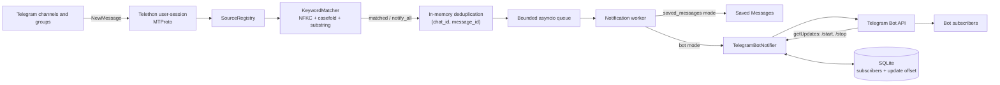

# Архітектура Telegram Keyword Monitor

## Призначення

Telegram Keyword Monitor — це окремий event-driven Python-сервіс, а не MCP-сервер. Він:

1. входить у Telegram як звичайний користувач;
2. слухає нові повідомлення тільки в налаштованих каналах і чатах;
3. застосовує keyword-фільтри або правило `notify_all=True`;
4. формує короткий alert із посиланням на оригінальне повідомлення;
5. надсилає alert у Saved Messages або всім користувачам, які підписалися на окремого бота.

Права адміністратора в monitored-чатах не потрібні. User-session бачить ті самі діалоги, що
й відповідний Telegram-акаунт.

## Технології

| Компонент | Технологія | Навіщо використовується |
|---|---|---|
| Runtime | Python 3.11+ та `asyncio` | Асинхронний listener, черги, polling і graceful shutdown |
| Telegram user client | Telethon 1.44+ | MTProto-підключення від імені звичайного акаунта та `NewMessage` events |
| Telegram bot client | Telegram Bot API через HTTPX | `/start`, `/stop` та push-розсилка підписникам |
| Конфігурація секретів | `python-dotenv` | Завантаження `.env` |
| Business-конфіг | TOML через стандартний `tomllib` | Локальні джерела, фільтри та runtime-параметри |
| Фільтрація | Власний Unicode substring matcher | Позитивні `keywords`, негативні `keywords_to_skip`, NFKC та `casefold()` |
| Персистентний стан | SQLite | Підписники бота та Bot API update offset |
| Тести | pytest, pytest-asyncio, pytest-cov | Офлайн unit та integration-style перевірки |
| Статичний аналіз | Ruff | Lint і форматування Python-коду |
| Деплой | Docker і Docker Compose | Довгоживучий процес та persistent volume для SQLite |

## Дві Telegram-ідентичності

Застосунок використовує два незалежні способи доступу до Telegram:

- **User-session / MTProto** читає канали й групи. Для нього потрібні
  `TELEGRAM_API_ID`, `TELEGRAM_API_HASH` і `TELEGRAM_SESSION_STRING`.
- **Bot API** приймає команди підписки й доставляє alerts. Для нього потрібен
  `TELEGRAM_BOT_TOKEN`.

Бота не потрібно додавати в monitored-канали. Він не читає джерела; це робить user-session.

## Загальна схема



## Основні модулі

| Файл | Відповідальність |
|---|---|
| [`config.py`](src/telegram_monitor/config.py) | Завантаження й валідація локального `config.toml` |
| [`models.py`](src/telegram_monitor/models.py) | Dataclass-моделі та валідація конфігурації |
| [`credentials.py`](src/telegram_monitor/credentials.py) | Безпечне читання Telegram credentials із середовища |
| [`client.py`](src/telegram_monitor/client.py) | Створення Telethon client із `StringSession`, reconnect і catch-up |
| [`registry.py`](src/telegram_monitor/registry.py) | Резолв username/ID у стабільні Telegram dialog IDs |
| [`matcher.py`](src/telegram_monitor/matcher.py) | Unicode-нормалізація та пошук keyword fragments |
| [`service.py`](src/telegram_monitor/service.py) | Event handler, startup buffer, deduplication, queue і notification worker |
| [`formatting.py`](src/telegram_monitor/formatting.py) | Формування plain-text alert і Telegram deep link |
| [`notifier.py`](src/telegram_monitor/notifier.py) | Saved Messages notifier, Bot API client, polling команд і broadcast |
| [`subscriber_store.py`](src/telegram_monitor/subscriber_store.py) | SQLite-сховище підписників і Bot API offset |
| [`app.py`](src/telegram_monitor/app.py) | Побудова компонентів та lifecycle застосунку |
| [`cli.py`](src/telegram_monitor/cli.py) | Команди `run`, `list-chats`, `generate-session`, `check` |

## Послідовність запуску

1. CLI налаштовує стандартний Python logging.
2. `config.toml` перетворюється на `MonitorConfig` і перевіряється: sources, timezone,
   queue/retry limits і bot limit.
3. Credentials завантажуються з `.env`.
4. Створюється Telethon client із `StringSession`.
5. До підключення реєструється catch-all `NewMessage` handler, щоб не втратити events під час
   завантаження діалогів.
6. Telethon перевіряє авторизацію user-session.
7. `SourceRegistry` зіставляє налаштований username або `-100…` ID з доступними dialogs.
8. Запускається notifier:
   - Saved Messages mode не потребує окремого background task;
   - bot mode викликає `getMe`, перевіряє відсутність webhook і запускає `getUpdates` polling.
9. Запускається notification worker і обробляється bounded startup buffer.
10. Основна coroutine чекає відключення Telethon до сигналу або фатальної помилки bot polling.

## Обробка нового повідомлення

1. Telethon створює `NewMessage` event.
2. У bot mode приймаються incoming і власні outgoing events. У Saved Messages mode — тільки
   incoming, щоб уникнути feedback loop від повідомлень notifier-а.
3. Event відкидається, якщо `chat_id` не належить до configured sources.
4. `KeywordMatcher` виконує:
   - Unicode NFKC normalization;
   - Unicode-aware `casefold()`;
   - substring match для кожного fragment.
5. Для перевірок останнього символу й довжини створюється тимчасова копія тексту без усіх
   `)` та emoji. Якщо вона після обрізання кінцевих пробілів закінчується на `?`, записується
   `Skip new message - datetime` без message text і alert не створюється.
6. Якщо ця копія коротша за 10 символів після обрізання пробілів, повідомлення так само
   пропускається. Оригінальний текст не змінюється й використовується для keyword-фільтрів
   та alert.
7. Якщо немає match і `notify_all=False`, у terminal log записується лише
   `Skip new message - datetime` без message text, після чого обробка зупиняється.
8. Після позитивної перевірки застосовується `keywords_to_skip`. Будь-який негативний match
   має пріоритет, записує `Skip new message - datetime` без message text і зупиняє обробку.
9. Для match або `notify_all=True` без негативного match записується
   `Match new message - datetime: preview`. Текст
   очищається від керувальних символів, перетворюється на один рядок і скорочується до 500
   символів.
10. `RecentMessageCache` атомарно claim-ить `(chat_id, message_id)`, щоб duplicate update не
   створив другий alert.
11. Автоматична копія channel post у linked discussion пропускається, якщо обидва джерела
   відстежуються. Ручні user forwards не пропускаються.
12. Створюється `MessageSnapshot`: source, author, text, time, matches, media і message ID.
13. `render_notification()` створює plain-text alert до Telegram limit 4096 символів.
14. Alert без блокуючих network calls додається в bounded `asyncio.Queue`.
15. Один background worker послідовно дістає alerts і передає їх notifier-у.

## Доставка alerts

### Saved Messages mode

`TelegramDialogNotifier` викликає Telethon `send_message()` для `notify_to`. Повідомлення
надсилається без Markdown parsing і без link preview.

### Bot mode

`TelegramBotNotifier` читає всі активні `chat_id` із SQLite та послідовно викликає Bot API
`sendMessage` для кожного підписника. Ліміт 10 робить послідовну розсилку достатньою й не
створює значного навантаження.

Retry виконується окремо для кожного одержувача. Це важливо: якщо дев'ять користувачів уже
отримали alert, тимчасова помилка десятого не повторює розсилку першим дев'ятьом. `429`
враховує Bot API `retry_after`; `5xx` і transport errors мають exponential backoff.

Якщо бот заблокований або chat більше недоступний (`403` чи `400 chat not found`), підписник
видаляється, а в log записується `Removed user (..., reason=unreachable)`.

## `/start`, `/stop` і ліміт 10

Bot API updates отримуються long polling-запитами `getUpdates`. Приймаються лише звичайні
messages із private chat.

- `/start` додає нового підписника.
- Повторний `/start` оновлює metadata й не займає другий слот.
- Після 10 активних користувачів новий отримує повідомлення про перевищення ліміту.
- `/stop` видаляє запис і звільняє слот.
- Group-команди та інший текст ігноруються.

Ліміт реалізований SQLite-транзакцією `BEGIN IMMEDIATE`: перевірка існуючого запису,
`COUNT(*)` та `INSERT` виконуються під одним write lock. Тому два одночасні `/start` не можуть
створити одинадцятого користувача.

## SQLite

За замовчуванням база розташована в `.state/bot_subscribers.sqlite3`.

Таблиця `bot_subscribers` зберігає:

- `bot_id`;
- `chat_id`;
- `user_id`;
- `username`;
- `first_name`;
- `subscribed_at`.

Primary key — `(bot_id, chat_id)`. Це ізолює підписників різних ботів, якщо token буде
замінено на token іншого бота.

Таблиця `bot_state` зберігає монотонний `next_update_offset` окремо для кожного `bot_id`.
Offset оновлюється після обробки update, тому вже підтверджені `/start` і `/stop` не
обробляються знову після рестарту.

SQLite працює в WAL mode із `busy_timeout=5000`. Усі runtime-звернення notifier-а до
синхронного `sqlite3` виконуються через `asyncio.to_thread()`, тому очікування database lock
не блокує Telegram event loop. Connection дозволяє cross-thread доступ, але всі операції над
ним серіалізовані через `RLock`.

## Черги, дедуплікація та retries

Значення за замовчуванням:

| Механізм | Значення | Призначення |
|---|---:|---|
| Notification queue | 1000 | Не блокувати Telegram event handler повільною доставкою |
| Startup buffer | 5000 | Приймати events до завершення dialog resolution |
| Deduplication cache | 2048 | Не обробляти повторний `(chat_id, message_id)` |
| Delivery attempts | 5 | Повторювати тимчасові помилки |
| Retry delay | 1–30 с | Exponential backoff |
| Bot polling timeout | 25 с | Long polling без busy-loop |

Notification queue і deduplication cache зберігаються тільки в RAM. SQLite персистить
підписників і Bot API offset, але не checkpoints monitored-чатів і не pending alerts.

## Bot polling lifecycle

Перед стартом polling:

1. `getMe` визначає стабільний `bot_id`;
2. `getWebhookInfo` перевіряє, що webhook відсутній;
3. виконується перший `getUpdates` handshake;
4. тільки після успішного handshake застосунок повідомляє, що bot polling готовий.

Webhook не видаляється автоматично. `409 Conflict` означає, що інший процес уже виконує
`getUpdates` із тим самим token; це фатальна configuration error. Якщо permanent polling
failure виникає після startup, notifier відключає Telethon client, щоб сервіс не продовжував
працювати в частково несправному стані.

## Конфігурація та secrets

Business-конфіг зберігається в локальному `config.toml`: джерела, keywords, режим доставки,
timezone, ліміти черг і retry-параметри. Файл ігнорується Git; у репозиторії є лише
`config.example.toml`. За замовчуванням він читається з поточної директорії, а
`MONITOR_CONFIG_FILE` дозволяє задати інший шлях.

Secrets зберігаються в `.env`:

```text
TELEGRAM_API_ID=...
TELEGRAM_API_HASH=...
TELEGRAM_SESSION_STRING=...
TELEGRAM_BOT_TOKEN=...
LOG_LEVEL=INFO
```

`TELEGRAM_SESSION_STRING` дає доступ рівня повноцінного Telegram-клієнта. Для monitor слід
використовувати окрему session/auth key, не комітити `.env` і не запускати одну session у
кількох процесах.

HTTPX request logging вимкнений, тому Bot API token, який є частиною URL, не повинен
потрапляти в application logs.

## Логи

Події пишуться стандартним модулем `logging` у stdout/stderr:

На logger `telethon.client.updates` встановлено точковий filter для `INFO`-повідомлень
`Got difference for channel <id> updates` та `Got difference for account updates`. Інші
Telethon `INFO`, `WARNING` та `ERROR`, а також application logs залишаються без змін.

```text
New user (...)
Skip new message - datetime
Match new message - datetime: preview
Removed user (..., reason=/stop)
Removed user (..., reason=unreachable)
Bot alert broadcast started (total=N)
Bot alert delivered to N/N subscriber(s)
Bot alert delivery incomplete (status=partial|failed, delivered=N, failed=N, ...)
```

Retryable Bot API delivery errors записуються як `WARNING` з `chat_id`, `error_code`,
`retry_after` і номером спроби. Остаточна помилка одержувача та partial/all broadcast failure
записуються як `ERROR`; лог також попереджає, що durable retry не запланований. Alert text,
Bot API request payload та token у ці delivery-логи не додаються.

У Docker ці streams зазвичай збираються Docker logging driver, тому вони не є тимчасовими в
сенсі приватності. Логи містять previews matched-повідомлень та Telegram user metadata;
доступ до них потрібно обмежувати.

## Docker deployment

Docker image:

- базується на `python:3.13-slim`;
- встановлює package з `pyproject.toml`;
- запускається як непривілейований user `monitor`;
- виконує `telegram-monitor run`.

Compose передає `.env`, монтує локальний `config.toml` у `/app/config.toml` лише для читання,
використовує `restart: unless-stopped` і монтує named volume `telegram-monitor-state` у
`/app/.state`. Завдяки цьому SQLite переживає recreate container, а приватний конфіг не
копіюється в image.

## Тестування

Тести не звертаються до реального Telegram. HTTP Bot API замінений `httpx.MockTransport`, а
Telethon events, dialogs і client lifecycle перевіряються fake-об'єктами або локально
сконструйованими updates.

Основні сценарії:

- Unicode keyword matching;
- username та numeric dialog resolution;
- incoming/outgoing events;
- startup buffering, queue overflow і deduplication;
- `/start`, `/stop`, limit 10 і конкурентний останній слот;
- Bot API retry, `retry_after`, blocked users, webhook і `409 Conflict`;
- SQLite persistence та bot isolation;
- token-safe errors і terminal-log sanitization.

Команди перевірки:

```bash
python -m pytest
python -m pytest --cov --cov-report=term-missing
ruff check .
ruff format --check .
```

## Поточні обмеження

- Немає history backfill після повного рестарту monitor.
- Немає persistent checkpoints для monitored chat message IDs.
- Немає durable outbox для alerts: після вичерпання retries невдала доставка не
  відновлюється після рестарту.
- Message edits не обробляються.
- Albums можуть створювати кілька alerts.
- Keyword matching є literal substring search, а не semantic classification.
- Перші 10 користувачів бота визначаються за принципом first come, first served; allowlist або
  admin approval відсутні.
- SQLite не шифрується на рівні застосунку.
